# Setup Guide: Instagram and Facebook MCP for Claude

The steps: download the project, create the settings file, set up Instagram and Facebook, set up followers and messages, optionally set up TikTok, and connect it to Claude. Section 8 lists everything Claude can do once it is connected.

Every command in this guide works the same on **Mac, Windows and Linux**. Type commands into a terminal: the **Terminal** app on a Mac, **PowerShell** on Windows. Paste one line at a time and press Enter. Commands in grey boxes go into the **Terminal** app, one line at a time.

**Download source:** https://github.com/Urnesto/facebook-ig-mcp.git

## 1. Download and install

```
cd ~
git clone https://github.com/Urnesto/facebook-ig-mcp.git
cd facebook-ig-mcp
```

Install the `uv` helper (once per computer). This is the only step that differs between systems, so use the line for yours, then close and reopen the terminal:

- **Mac or Linux:** `curl -LsSf https://astral.sh/uv/install.sh | sh`
- **Windows (PowerShell):** `powershell -ExecutionPolicy ByPass -c "irm https://astral.sh/uv/install.ps1 | iex"`

Install the project:

```
cd ~/facebook-ig-mcp
uv venv --python 3.12
uv pip install -r requirements.txt
```

If the computer says `git` is not found, install it from https://git-scm.com/downloads or use the ZIP download below.

Links if you cannot find it:

- The project on GitHub: https://github.com/Urnesto/facebook-ig-mcp
- Download it as a ZIP file instead of using `git`: https://github.com/Urnesto/facebook-ig-mcp/archive/refs/heads/main.zip
- The `uv` helper: https://docs.astral.sh/uv/getting-started/installation/
- Git: https://git-scm.com/downloads
- Claude Code: https://claude.com/claude-code

## 2. Create the settings file

All keys and passwords live in one file named `.env` in the project folder. The setup wizard creates the file and fills it in for you:

```
cd ~/facebook-ig-mcp
uv run python -m src.setup_wizard
```

The wizard asks for each value in turn. Secrets are hidden while you type or paste them. Press Enter to skip a value you do not have yet, and run the wizard again whenever you have more. It never shows what is already saved.

You get the values in sections 3 to 5. To see what is filled in so far, without showing any value:

```
uv run python -m src.setup_wizard --status
```

If you prefer to edit the file by hand: make a copy of `env.example`, name the copy `.env`, and open it in a text editor (TextEdit on a Mac, Notepad on Windows). Write each value straight after the `=` sign, with no spaces and no quotation marks, and leave every other line as it is.

| Setting | What to put there | Step |
|---|---|---|
| `FACEBOOK_APP_ID` | Facebook key: App ID of your Meta app | 3.3 |
| `FACEBOOK_APP_SECRET` | Facebook key: App secret of your Meta app | 3.3 |
| `INSTAGRAM_ACCESS_TOKEN` | Instagram key: Page access token | 3.4 |
| `INSTAGRAM_BUSINESS_ACCOUNT_ID` | Instagram key: Instagram account number | 3.4 |
| `INSTAGRAM_USERNAME` | Instagram username, without the @ sign | 4.1 |
| `INSTAGRAM_PASSWORD` | Instagram password | 4.1 |
| `TIKTOK_CLIENT_KEY` | TikTok key: Client key of your TikTok app (optional) | 5.9 |
| `TIKTOK_CLIENT_SECRET` | TikTok key: Client secret of your TikTok app (optional) | 5.9 |

> **Important:** the `.env` file contains passwords. Never share it or upload it anywhere.

## 3. Set up Instagram and Facebook (Meta)

This part gives Claude official access to your Instagram business account and your Facebook Page. It assumes the Instagram account is already a Business or Creator account. It covers profile information, posts, statistics, publishing to Instagram and publishing to the Facebook Page. You do it once, in a web browser.

Meta changes its screens from time to time, so button names may differ slightly from the ones below.

### Step 3.1. Link the Instagram account to a Facebook Page

The keys are issued through a Facebook Page, so the Instagram account must be linked to one that you manage.

1. If you have no Page yet, open https://www.facebook.com/pages/create , type a **Page name** and a **Category**, and click **Create Page**.

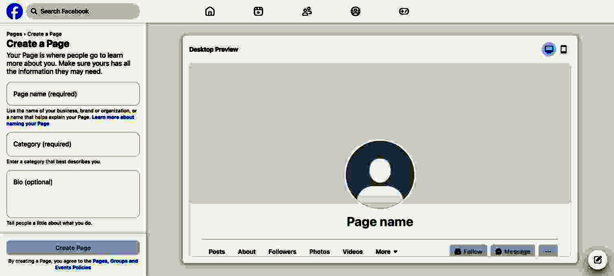

*Creating a Page: fill in the Page name and Category on the left, then click "Create Page".*

2. Log in to Facebook and click your profile photo in the top right.
3. Click **See all profiles** and select your Page.
4. Click the Page's profile picture in the top right, then **Settings & privacy → Settings**.
5. Under **Permissions**, click **Linked accounts**.
6. Click **Instagram**, then **Connect account**, and log in to your Instagram business account.

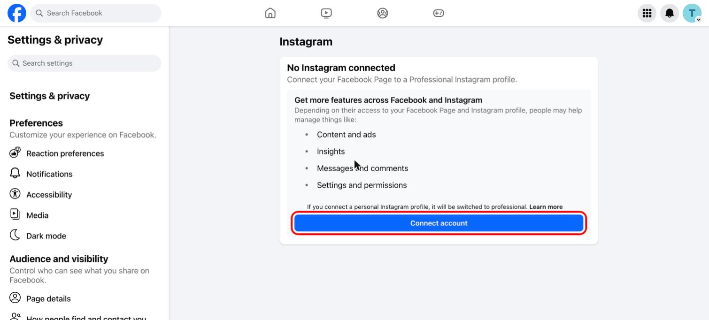

*The Instagram screen in the Page's settings. Click "Connect account".*

Shortcut: once you have selected the Page in step 3, this link opens the same screen directly: https://www.facebook.com/settings/?tab=linked_instagram

Links if you cannot find it:

- Create a Page: https://www.facebook.com/pages/create
- Your Pages: https://www.facebook.com/pages/?category=your_pages
- Facebook's own instructions for connecting Instagram to a Page: https://www.facebook.com/help/1148909221857370

### Step 3.2. Create a Meta app

The "app" is only a container for your keys. Nobody else sees it and you do not need to publish it.

1. Go to https://developers.facebook.com/apps/ and log in with the Facebook account that manages the Page. If asked, register as a developer. It is free and takes a minute.
2. Click the green **Create App** button.

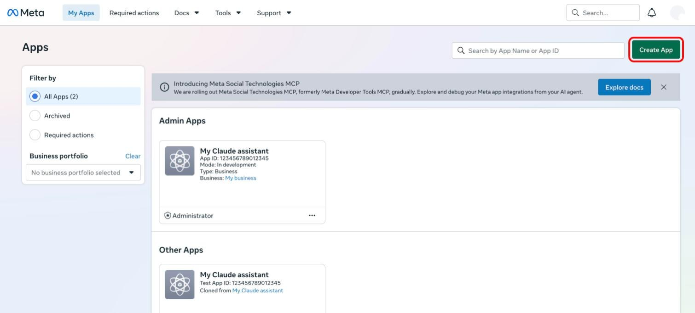

*My Apps. Click "Create App" in the top right.*

3. **App details:** type any app name (for example "My Claude assistant"). Your email is filled in already. Click **Next**.

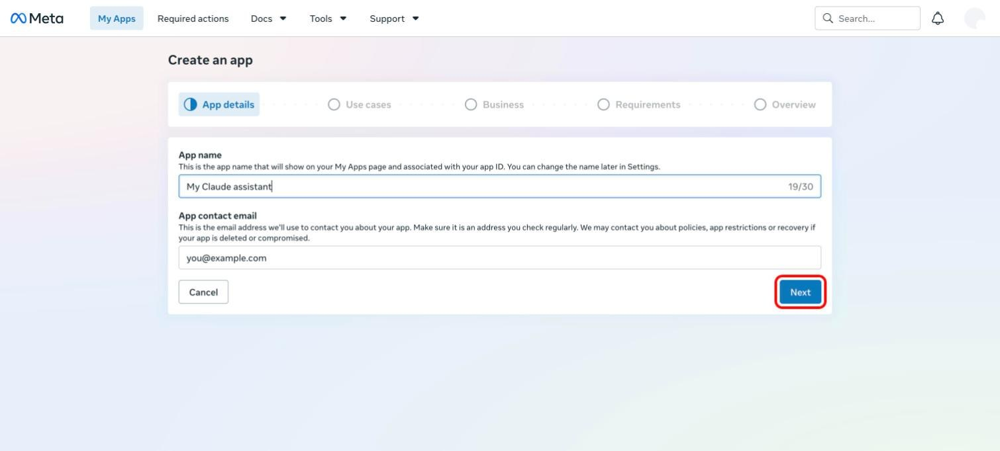

*Step 1 of 5: App details. Type a name and click "Next".*

4. **Use cases:** in the **Filter by** list on the left, click **Content management**.

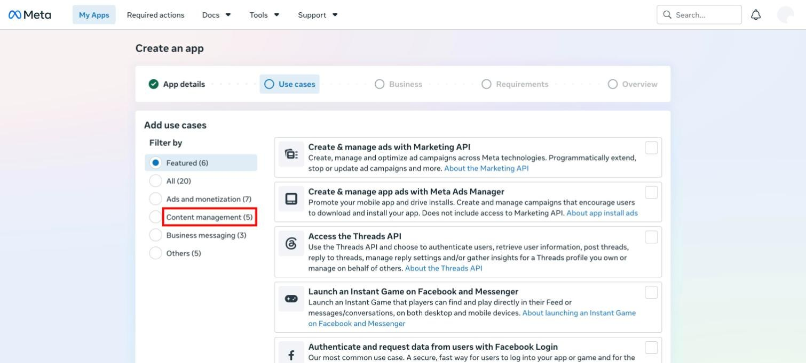

*Step 2 of 5: click "Content management" to find the two use cases you need.*

5. Tick **Manage messaging & content on Instagram** and **Manage everything on your Page**. Scroll down and click **Next**.

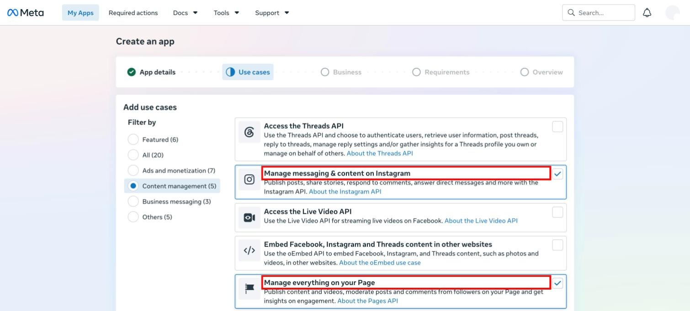

*Tick the two marked use cases.*

6. **Business:** select **I don't want to connect a business portfolio yet** and click **Next**.

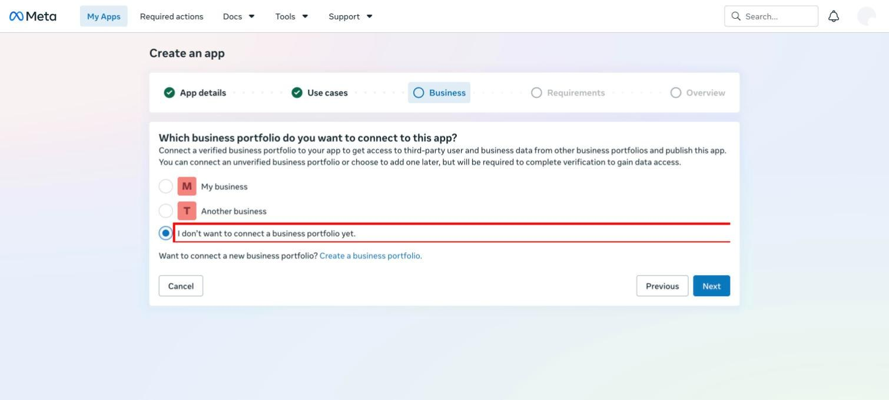

*Step 3 of 5: choose the last option.*

7. **Requirements:** there is nothing to do. Click **Next**.

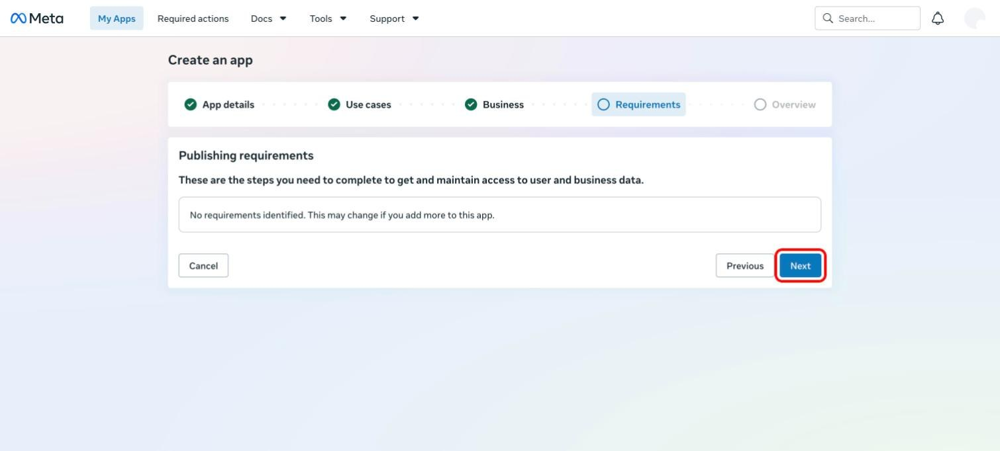

*Step 4 of 5: just click "Next".*

8. **Overview:** check the summary and click the green **Create app** button at the bottom. Facebook may ask for your password.

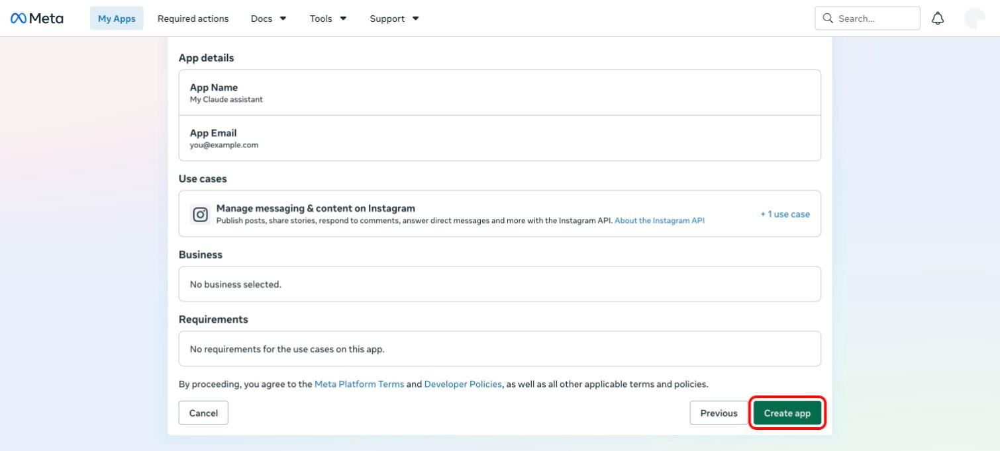

*Step 5 of 5: click "Create app".*

Leave the app in **Development** mode. That is enough for your own Page and account, and no review by Meta is needed.

Links if you cannot find it:

- Start creating an app directly: https://developers.facebook.com/apps/creation/
- Your apps: https://developers.facebook.com/apps/
- Meta's own instructions: https://developers.facebook.com/docs/development/create-an-app

### Step 3.3. Facebook keys: App ID and App secret

1. Open https://developers.facebook.com/apps/ and click your app.
2. In the left menu, click **App settings**, then **Basic**.
3. Copy the **App ID** and paste it after `FACEBOOK_APP_ID=` in the `.env` file.
4. Click **Show** next to **App secret**, enter your Facebook password, copy the secret, and paste it after `FACEBOOK_APP_SECRET=`.

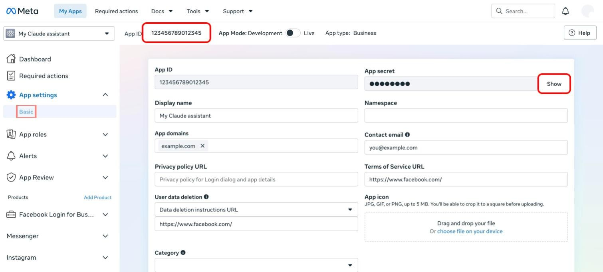

*App settings → Basic. The App ID is at the top, and "Show" reveals the App secret.*

### Step 3.4. Instagram keys: access token and account number

The two Instagram keys are the **access token** (the key Claude uses to act for your Instagram account and Page) and the **Instagram account number** (which account to act on). You get both from one tool, the Graph API Explorer. You make a short token first, extend it, and then swap it for the Page token.

1. Open the Graph API Explorer: https://developers.facebook.com/tools/explorer/
2. On the right, under **Meta App**, pick the app you created.

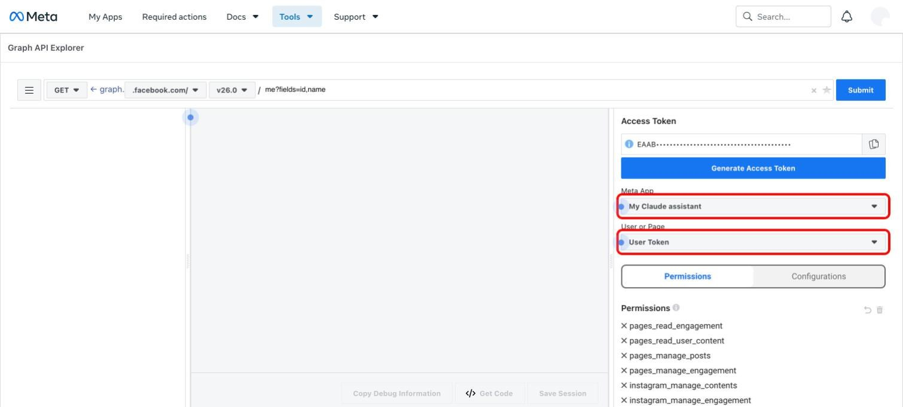

*The two dropdowns you need are on the right: "Meta App" and "User or Page".*

3. Click the **User or Page** dropdown and choose **Get User Access Token**.

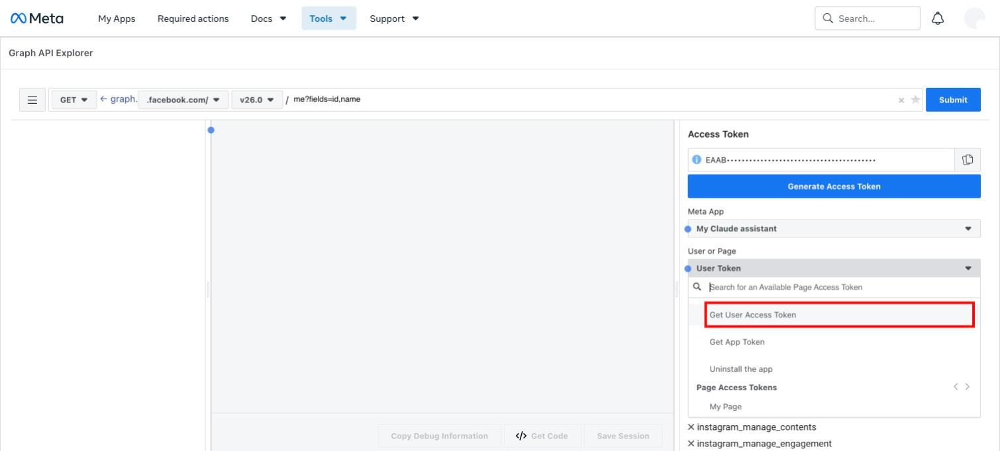

*Choose "Get User Access Token".*

4. Under **Permissions**, open the dropdown below **Add a Permission** and tick each of these:
   - `pages_show_list` (see your Pages)
   - `pages_read_engagement` (read Page content)
   - `pages_read_user_content` (read comments on the Page)
   - `pages_manage_engagement` (reply to, hide and delete Page comments)
   - `pages_manage_posts` (publish to the Facebook Page)
   - `instagram_basic` (read the Instagram profile and posts)
   - `instagram_content_publish` (publish to Instagram)
   - `instagram_manage_insights` (read statistics)
   - `instagram_manage_comments` (read and reply to Instagram comments)
   - `read_insights` (read Page statistics)
   - `business_management` (needed when the Page belongs to a business account)
   - `instagram_manage_messages` (only if you want to read and reply to DMs)
   - `pages_manage_metadata` (only together with `instagram_manage_messages`; Meta requires it for DMs)

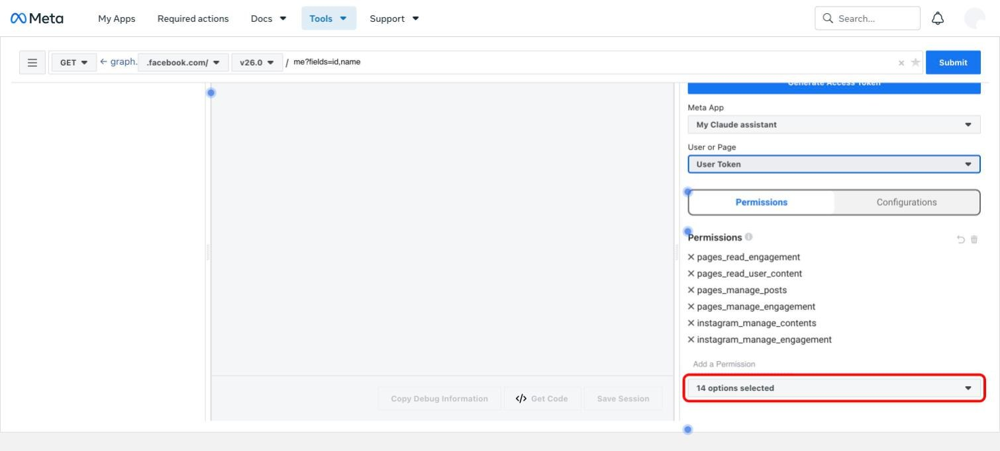

*Permissions you have added are listed above the dropdown. Open the dropdown to add more.*

5. Click **Generate Access Token**. A Facebook window opens. Select your **Page** and your **Instagram account** when it asks what to give access to, and approve everything.

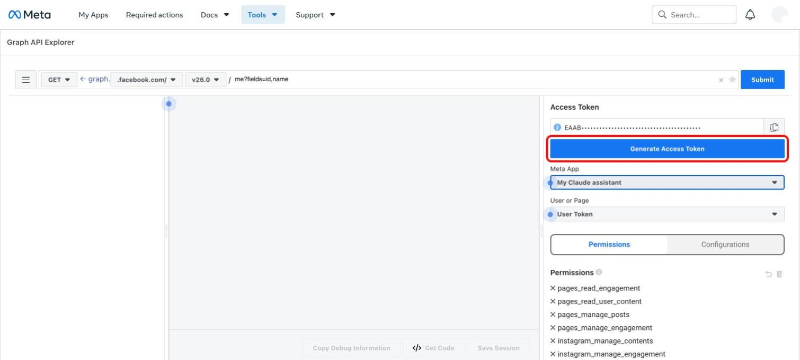

*Click "Generate Access Token".*

   **Shortcut:** copy the token now, run `uv run python -m src.setup_wizard meta`, and paste it when the wizard asks for the user access token. The wizard extends the token, finds your Page and saves both Instagram keys, so you can skip steps 6 to 13.

6. Click the small blue **ⓘ** icon to the left of the token. In the window that opens, click **Open in Access Token Tool**.

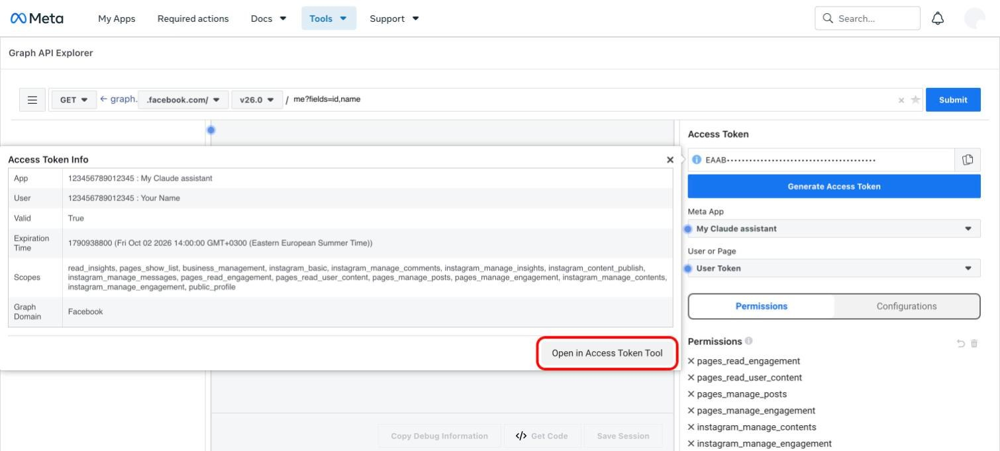

*The token info window. Click "Open in Access Token Tool".*

7. A new tab opens. Scroll to the bottom and click **Extend Access Token**. Copy the new, longer token that appears.

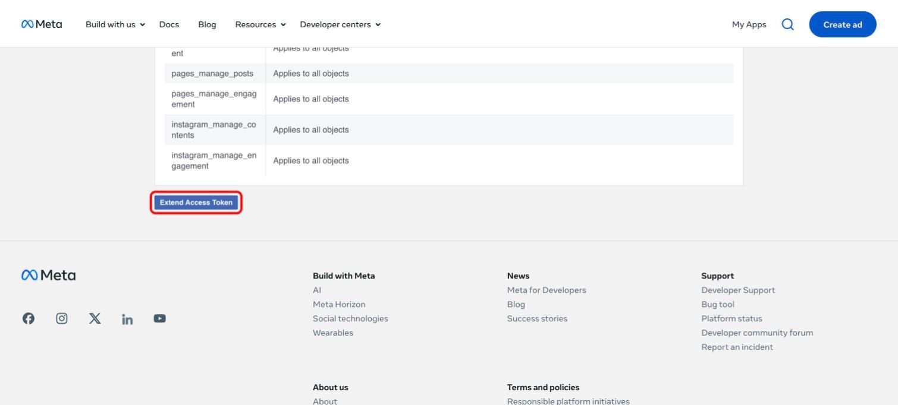

*"Extend Access Token" is at the bottom of the page.*

8. Go back to the Graph API Explorer tab and paste the extended token into the **Access Token** box, replacing the old one.
9. Click in the address line at the top, delete what is there, and type this instead. Then click **Submit**:

   ```
   me/accounts?fields=name,access_token,instagram_business_account
   ```

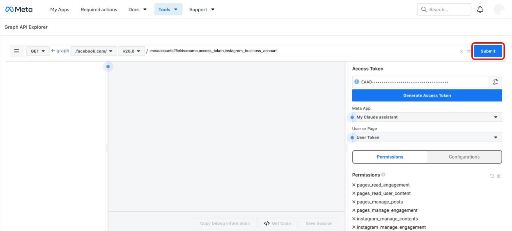

*Type the line into the address field and click "Submit".*

10. The answer lists your Pages. Find your Page by its `"name"`.
11. Copy the long text after `"access_token"` (without the quotation marks) and paste it after `INSTAGRAM_ACCESS_TOKEN=`.
12. Copy the number after `"id"` inside `"instagram_business_account"` and paste it after `INSTAGRAM_BUSINESS_ACCOUNT_ID=`.

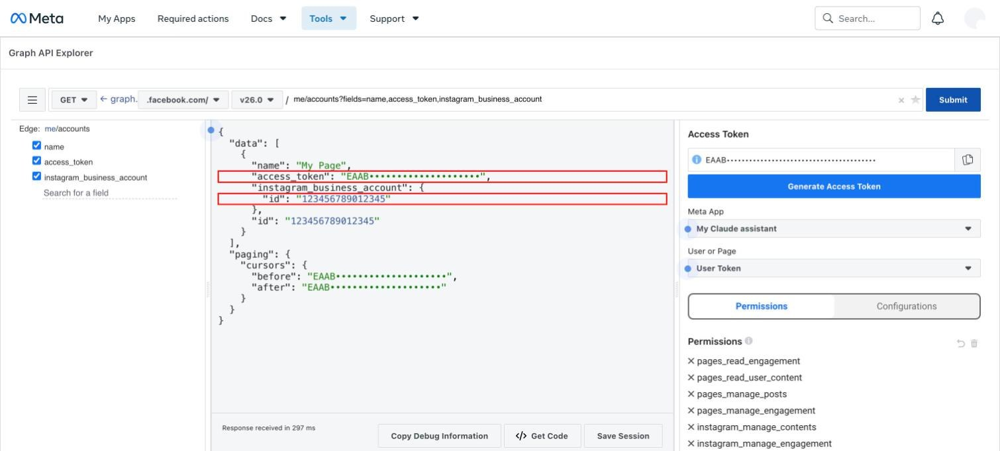

*The two marked lines are your Instagram keys: the access token and the Instagram account number.*

13. Save the `.env` file.

A Page token made this way normally does not expire. If Claude later says the token is invalid, repeat step 3.4.

Links if you cannot find it:

- Graph API Explorer: https://developers.facebook.com/tools/explorer/
- Access Token Debugger (where "Extend Access Token" is): https://developers.facebook.com/tools/debug/accesstoken/
- Meta's instructions for long-lived tokens: https://developers.facebook.com/docs/facebook-login/guides/access-tokens/get-long-lived
- Meta's guide to the Explorer: https://developers.facebook.com/docs/graph-api/guides/explorer

### If something looks wrong

| What you see | What it means |
|---|---|
| The answer in step 9 of 3.4 is empty (`"data": []`) | Your Page was not selected in the Facebook window in step 5 of 3.4. Generate the token again and select the Page. |
| There is no `instagram_business_account` in the answer | The Instagram account is not a Business or Creator account, or it is not linked to the Page. Repeat step 3.1. |
| Facebook posting is refused later | `pages_manage_posts` was not ticked in step 4 of 3.4. Repeat step 3.4. |
| Reading or replying to DMs is refused | Meta has not granted "Advanced Access" for messages. See `INSTAGRAM_DM_SETUP.md` in the project folder. |
| The list of DM conversations is empty although you have messages | `instagram_manage_messages` alone is not enough. Tick `pages_manage_metadata` too and repeat step 3.4, then in the Instagram app switch on **Settings → Messages and story replies → Message controls → Connected tools → Allow access to messages**. Until Meta grants "Advanced Access", only messages from people who have a role on your Meta app are shown. |

## 4. Set up followers and messages

Meta's official access cannot list your followers or message someone who has not written to you first. For those two things the project logs in to Instagram with the username and password, like the phone app does.

> **Recommended:** Instagram does not approve of this kind of login and can restrict or ban an account that uses it. Use a spare account, not one that matters to your business.

### Step 4.1. Add the login to the settings file

Run the wizard for this part and type the Instagram username (without the @ sign) and the password when asked:

```
cd ~/facebook-ig-mcp
uv run python -m src.setup_wizard instagram
```

Two-factor authentication must be switched off on this account. The login does not support it.

### Step 4.2. Log in once

```
cd ~/facebook-ig-mcp
uv run python -m src.unofficial_client
```

1. Instagram usually emails a 6-digit code to the account's address. Open the newest email from Instagram.
2. Type the code into the terminal and press Enter.
3. Wait for **Logged in as …**. The login is now saved in the `data` folder and is reused every time.

If Instagram later asks for a code again, repeat this step.

### Step 4.3. What you can do afterwards

Once Claude is connected (section 6), ask Claude things like these:

| You ask | What happens |
|---|---|
| "Get my Instagram followers." | Claude lists every follower and saves the list as `data/followers_USERNAME.csv`, which opens in Excel, Numbers or Google Sheets. |
| "Who are my new followers since last time?" | Claude compares with the previous list and shows who is new and who left. |
| "Send a DM to USERNAME: Hello!" | Claude sends that message to the user. |
| "Show my Instagram usage." | Claude shows how many actions are used today and who was already messaged. |

The project protects the account with its own limits:

- **10 follower list downloads per 24 hours.**
- **20 direct messages per 24 hours.**
- **No double messages.** Claude refuses to message a user who was already messaged, unless you clearly say you want to message that person again.

Send a few messages at a time, and do not send the same text to many people.

## 5. Set up TikTok (optional)

This part lets Claude post videos and photos to TikTok through TikTok's official Content Posting API. Skip it if you do not use TikTok.

> **Important:** until TikTok has reviewed and audited your app, every post made this way is visible only to you, and TikTok only accepts posts to an account that is set to private. Public posting needs TikTok's approval.

### Step 5.1. Create a TikTok account

Skip this step if you already have the TikTok account you want to post to.

1. Download the TikTok app from the App Store or Google Play and open it.
2. Choose a sign-up method (email or phone number) and follow the steps to create the account.
3. Use a real email or phone number. TikTok needs it for logging in and for recovering the password.

Then set the account to private, because TikTok only accepts posts from an unreviewed app to a private account:

1. In the TikTok app, tap **Profile** at the bottom.
2. Tap the **Menu** button (three lines) at the top.
3. Tap **Settings and privacy**, then **Privacy**.
4. Turn **Private account** on.

You can turn it off again once TikTok has approved your app for public posting.

Links if you cannot find it:

- Create a TikTok account in a browser: https://www.tiktok.com/signup
- TikTok's instructions for creating an account: https://support.tiktok.com/en/getting-started/creating-an-account
- TikTok's instructions for a private account: https://support.tiktok.com/en/account-and-privacy/account-privacy-settings/making-your-account-public-or-private

### Step 5.2. Create a TikTok developer account

The developer site has its own account. It is separate from your normal TikTok login.

1. Go to https://developers.tiktok.com/signup
2. Type your email and click **Send PIN to email**.
3. Type the PIN from the email, choose a password, and finish the sign-up.

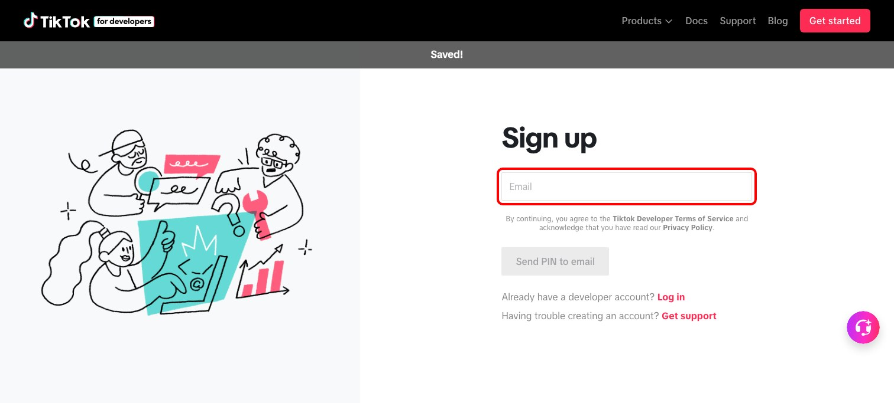

*The developer sign-up page. Type your email in the marked field.*

Links if you cannot find it:

- Developer sign-up: https://developers.tiktok.com/signup
- Developer login: https://developers.tiktok.com/login

### Step 5.3. Create the app

1. Click your profile icon in the top right, then **Manage apps**. Click the red **Connect an app** button.

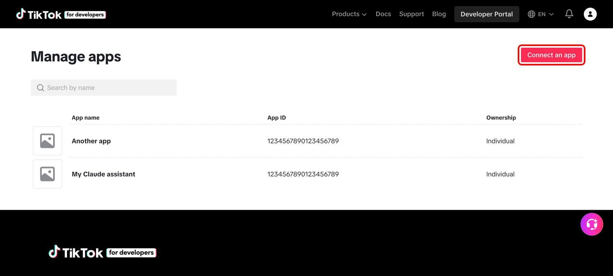

*Manage apps. Click "Connect an app" in the top right.*

2. In the **Create app** window, select **Individual** and click **Confirm**. TikTok creates the app and opens its page.

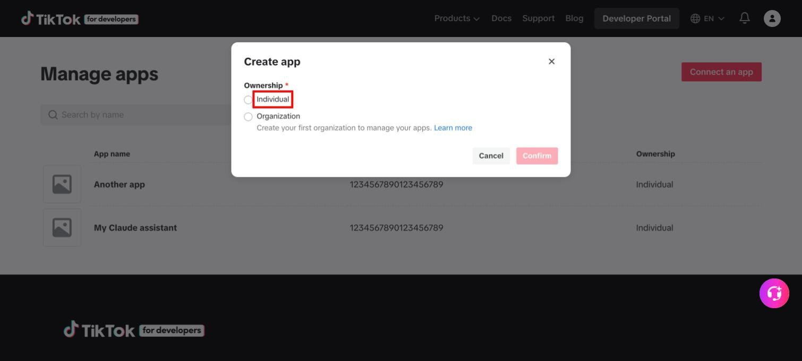

*Select "Individual", then click "Confirm".*

3. To come back to the app later, open **Manage apps** and click the app's name.

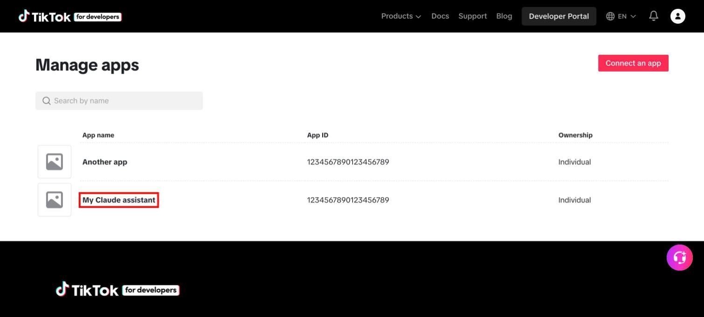

*Click the app's name to open its page.*

### Step 5.4. Create a sandbox

A sandbox is a test copy of the app. It lets you post privately without waiting for TikTok's review.

1. At the top of the app page, next to the app's name, click **Sandbox**.

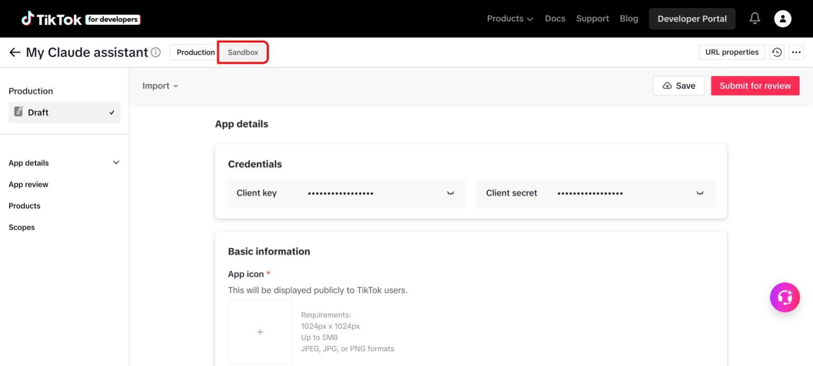

*The Production / Sandbox switch sits next to the app's name.*

2. Click **Create Sandbox**.

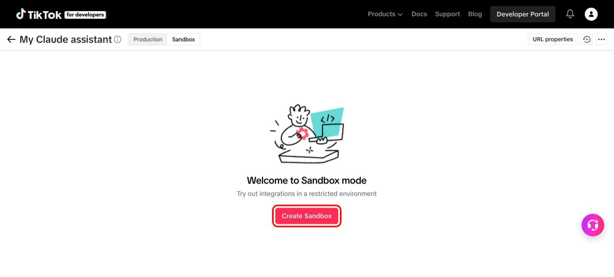

*Click "Create Sandbox".*

3. Type any name (for example "Claude test") and click **Confirm**.

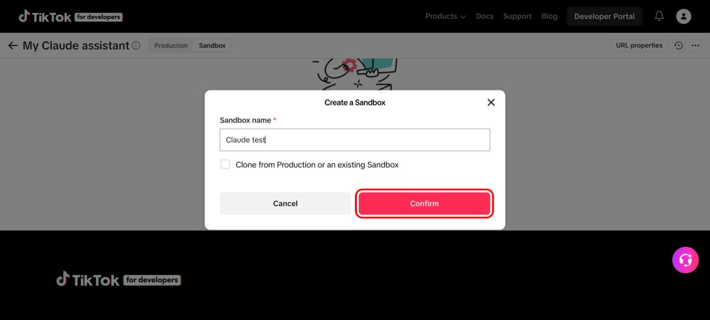

*Type a name and click "Confirm".*

### Step 5.5. Fill in the app details

TikTok refuses to save the sandbox until every field with a red star is filled in. Scroll down the page and fill in **Basic information**:

1. **App icon:** click the square with the plus sign and choose a picture of 1024 x 1024 pixels (JPG or PNG).
2. **App name:** the name people see when they log in. Yours is already filled in.
3. **Category:** pick the one closest to what you do.
4. **Description:** one sentence, for example "Posts my own videos to my TikTok account."
5. **Terms of Service URL** and **Privacy Policy URL:** links to those pages on your website.

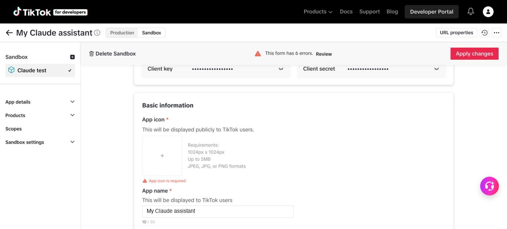

*Basic information starts with the App icon and App name.*

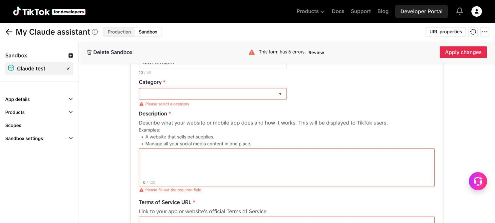

*Fields left empty turn red when you try to save.*

6. Under **Platforms**, tick **Desktop**.

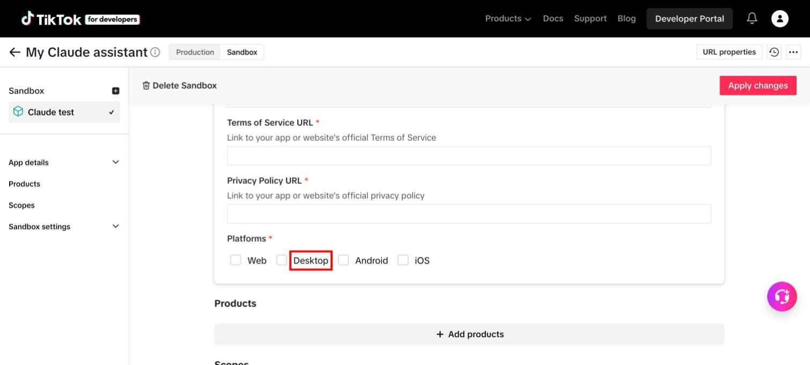

*Tick "Desktop" under Platforms.*

7. A new field **Web/Desktop URL** appears. Type the address of your website.

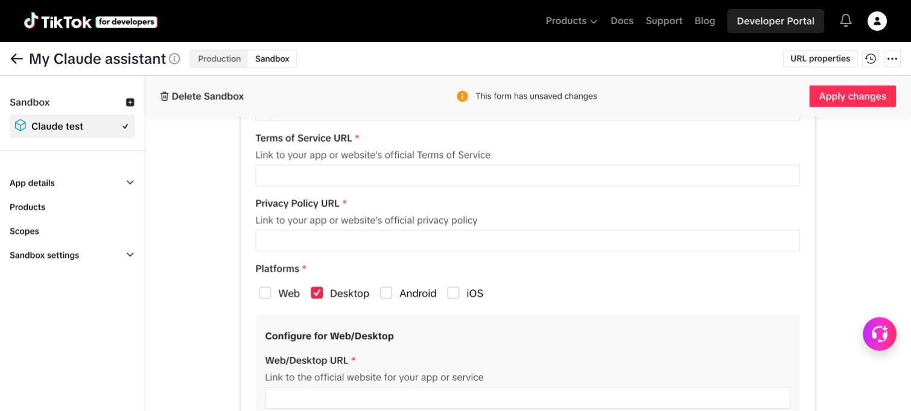

*After ticking Desktop, fill in the Web/Desktop URL.*

### Step 5.6. Add the two products

1. Scroll to **Products** and click **Add products**.

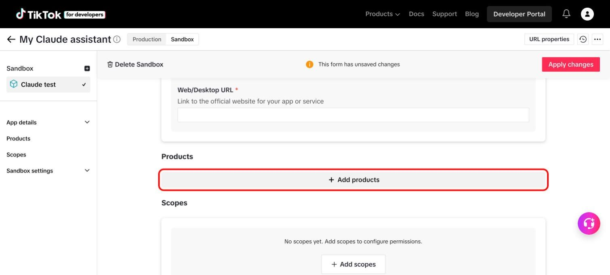

*Click "Add products".*

2. Click **Add** under **Login Kit**. It must be added first.

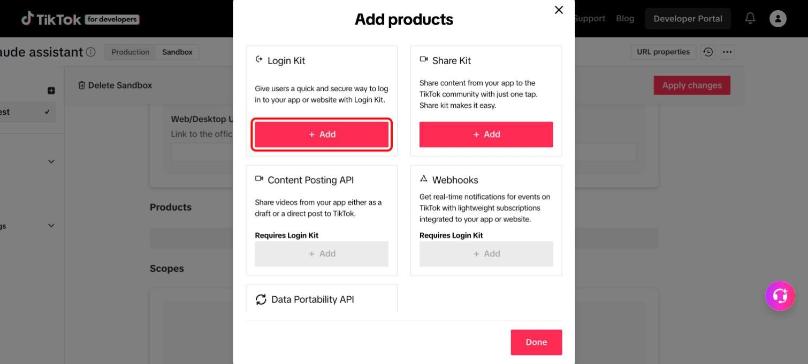

*Add "Login Kit" first. Content Posting API is still grey.*

3. Click **Add** under **Content Posting API**, which is now red.

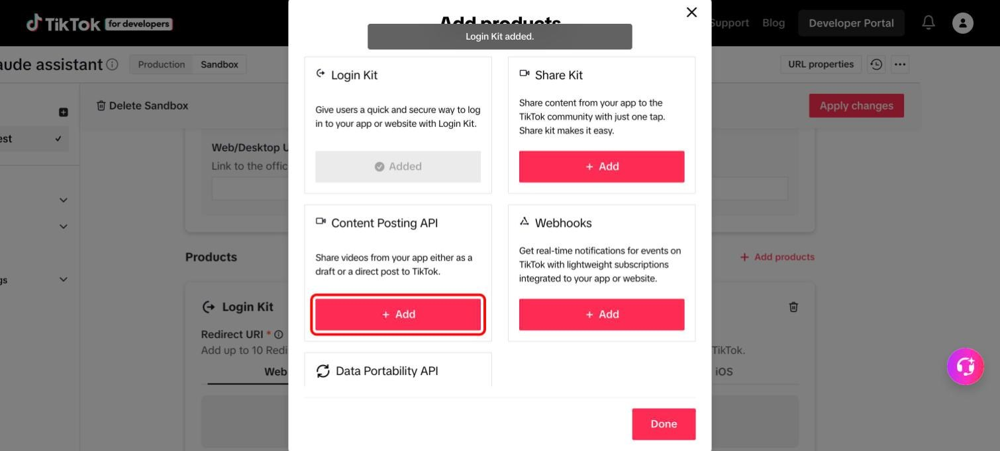

*Then add "Content Posting API".*

4. Click **Done**.

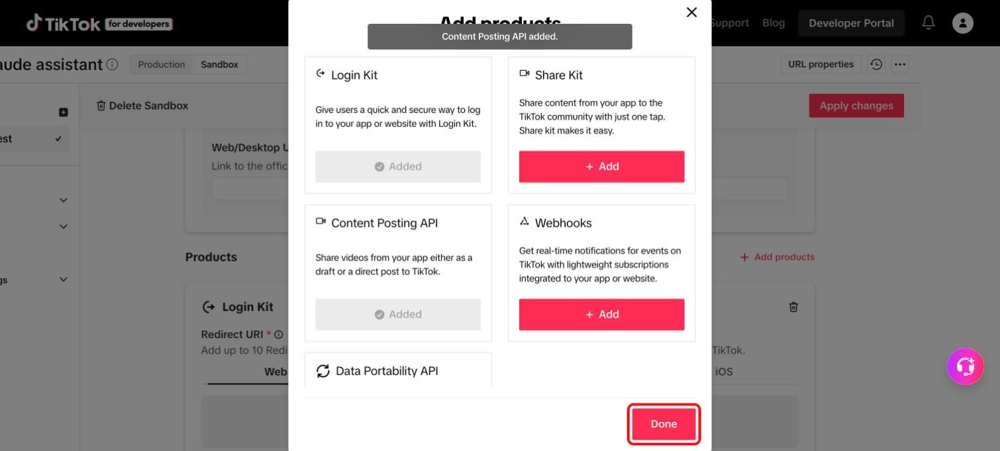

*Both products show "Added". Click "Done".*

### Step 5.7. Set the redirect address and switch on Direct Post

1. In the **Login Kit** box, click the **Desktop** tab.

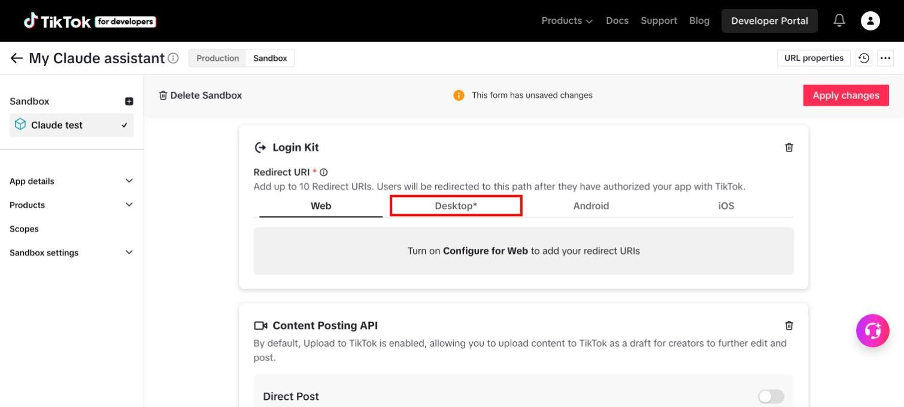

*Click the "Desktop" tab under Redirect URI.*

2. Type this address into the field, exactly as written:

```
http://localhost:3455/callback/
```

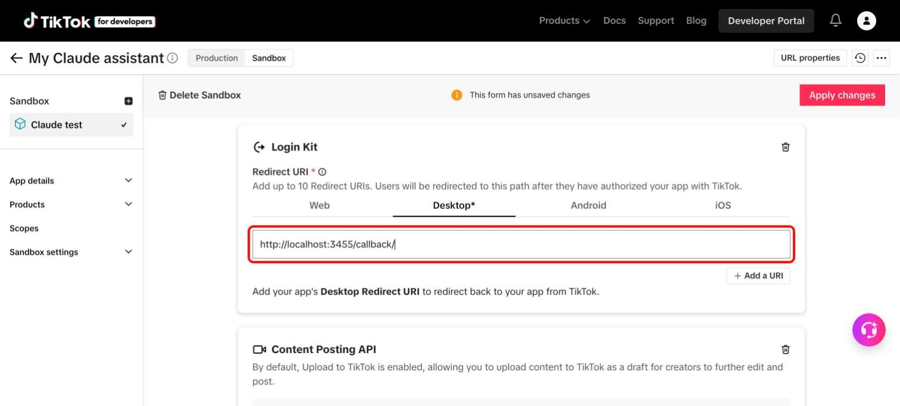

*The redirect address typed into the Desktop field.*

3. In the **Content Posting API** box, switch on **Direct Post**.

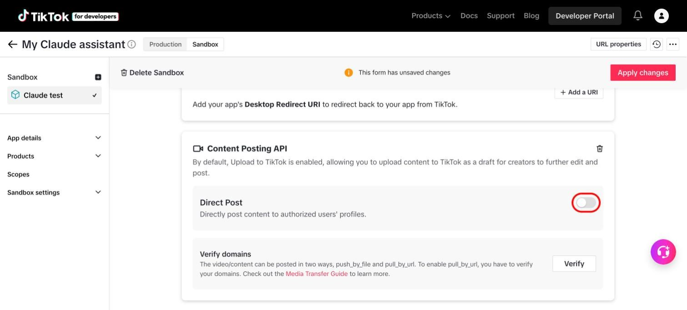

*Switch on "Direct Post".*

4. Check the **Scopes** section. It should now list `user.info.basic`, `video.publish` and `video.upload`. They are added automatically by the two products, so there is nothing to add by hand.

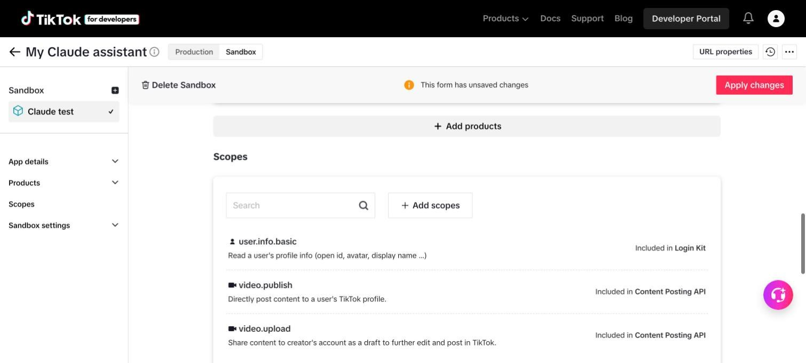

*The three scopes appear on their own.*

### Step 5.8. Add your TikTok account as a target user

A sandbox only works for TikTok accounts you add to it.

1. Scroll to **Sandbox settings** and click **Add account** under **Target Users**.
2. Click **Continue**, log in with the TikTok account from step 5.1 and accept the terms. A newly added account can take up to an hour to become active.

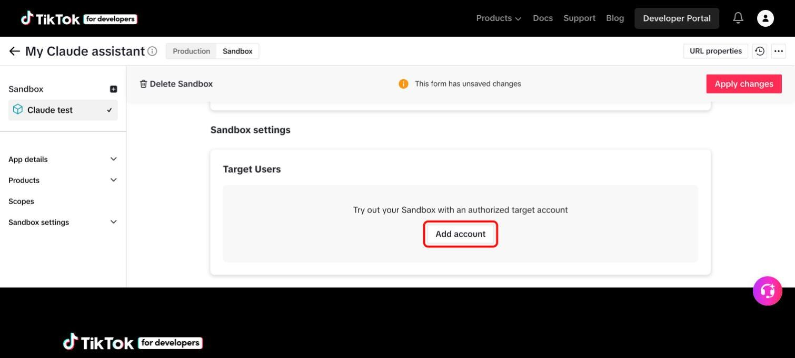

*Click "Add account" and log in with your TikTok account.*

### Step 5.9. Save, then copy the two keys

1. Click **Apply changes** in the top right. If a red message says the form has errors, click **Review** next to it and fill in what is missing from step 5.5.

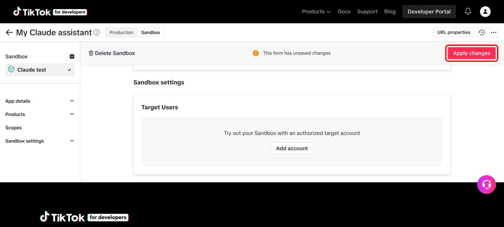

*"Apply changes" saves everything you did in the sandbox.*

2. Scroll to the top of the sandbox page and find **Credentials**.
3. Click the eye icon next to **Client key**, copy the key, and paste it after `TIKTOK_CLIENT_KEY=` in the `.env` file.
4. Do the same for **Client secret** and paste it after `TIKTOK_CLIENT_SECRET=`. Save the file. Or run `uv run python -m src.setup_wizard tiktok` and paste both keys when asked.

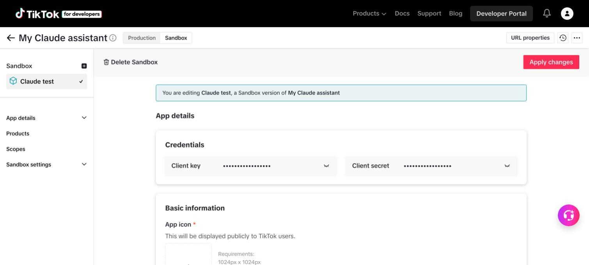

*Copy the keys from the Sandbox page, not from Production. They are hidden until you click the eye icons.*

Links if you cannot find it:

- Your TikTok apps: https://developers.tiktok.com/apps/
- TikTok's instructions for registering an app: https://developers.tiktok.com/doc/getting-started-create-an-app
- TikTok's instructions for a sandbox: https://developers.tiktok.com/doc/add-a-sandbox
- TikTok's guide to posting with the Content Posting API: https://developers.tiktok.com/doc/content-posting-api-get-started
- TikTok's login guide for desktop apps (the redirect address): https://developers.tiktok.com/doc/login-kit-desktop

### Step 5.10. Log in to TikTok once

```
cd ~/facebook-ig-mcp
uv run python -m src.tiktok_client
```

1. Your browser opens a TikTok page. Log in and click **Authorize**.
2. The browser shows "TikTok login received". Go back to the terminal.
3. Wait for **Logged in to TikTok**. The login is saved in the `data` folder and renews itself for a year.

### Step 5.11. What you can do afterwards

| You ask | What happens |
|---|---|
| "Which TikTok account is connected?" | Claude shows the account and which privacy levels TikTok allows. |
| "Post the video clip.mp4 from my Downloads folder to TikTok with the caption: Hello!" | Claude uploads the video as a private post and gives you a post number. |
| "Check the status of that TikTok post." | Claude says whether it is still processing, published or failed. |

Things to know:

- **Videos** can come from a file on your computer.
- **Photos** must already be on a website whose address you have verified in the TikTok app page (**URL properties**).
- The project allows **15 TikTok posts per 24 hours**.
- To post publicly, follow step 5.12: import the sandbox into **Production**, submit it for review, and pass TikTok's audit.

### Step 5.12. Go live: import the sandbox into Production and submit it for review

The sandbox is only for testing: it works for the accounts you added, and every post stays private. When everything works and you want to post publicly, copy the sandbox settings into **Production** and send the app to TikTok for review. You only do this once.

1. Open your app page and click **Production**, next to the app's name. Then click **Import**.

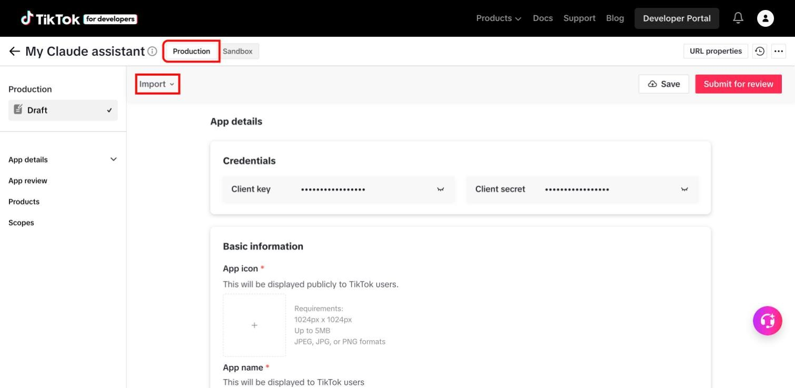

*Switch to "Production", then click "Import".*

2. Under **Import from Sandbox**, click the name of your sandbox (for example "Claude test"). Everything you set up in the sandbox is copied into Production: app details, products, redirect address and Direct Post.

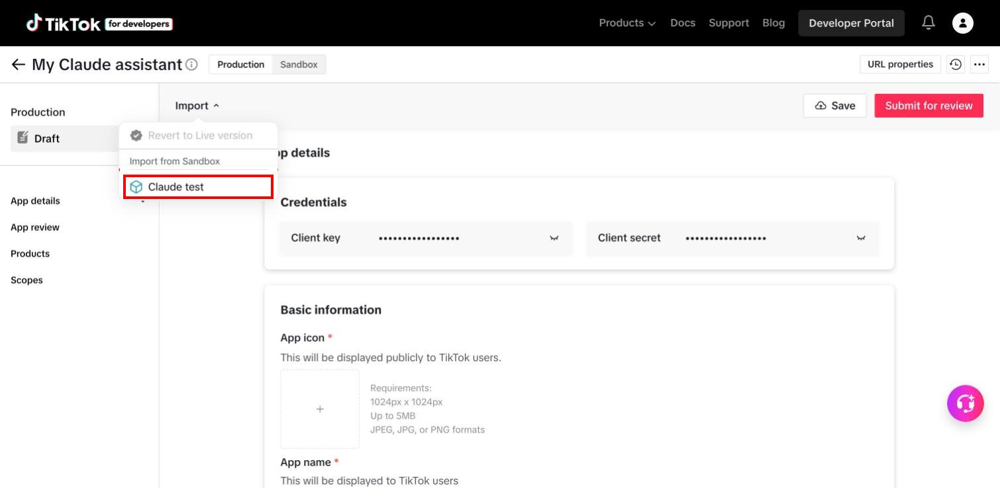

*Choose your sandbox under "Import from Sandbox".*

3. Scroll to **App review**. In the text box, explain in a few sentences how the app uses each product, for example: "Login Kit lets me log in with my own TikTok account. Content Posting API with Direct Post publishes my own videos to my account."
4. Upload a short demo video that shows the app posting a video, if the page asks for one.
5. Click **Save**, then **Submit for review**.

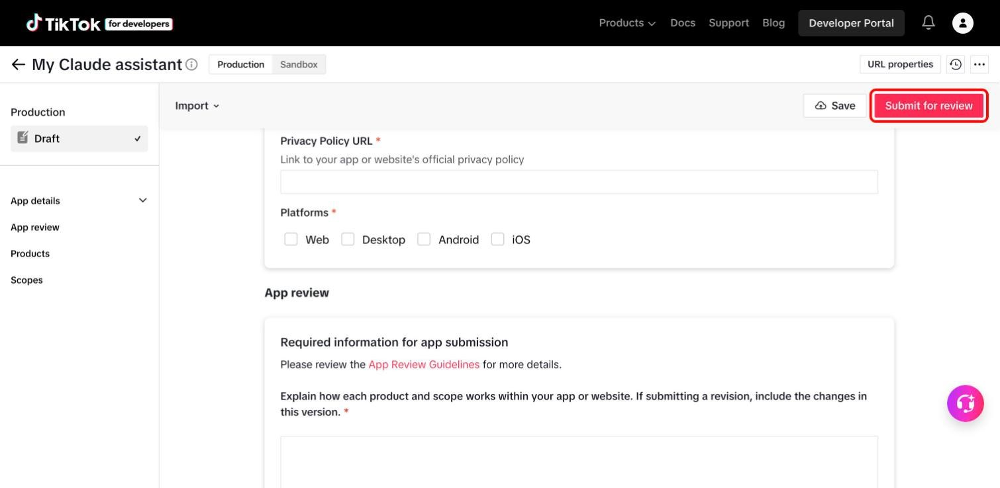

*Fill in the App review box, then click "Submit for review".*

6. Wait for TikTok's answer. It arrives by email and under the bell icon on the developer site. If TikTok asks for changes, fix them and submit again.

After TikTok approves the app:

- **Switch the keys.** Production has its own Client key and Client secret. Copy them from the **Production** page into `TIKTOK_CLIENT_KEY=` and `TIKTOK_CLIENT_SECRET=` in the `.env` file, replacing the sandbox ones.
- **Log in again.** Repeat step 5.10 once, then reconnect with `/mcp` in Claude Code.
- **Public posts need one more approval.** Posts stay private until TikTok has also audited the app for the Content Posting API. Until that audit passes, keep the TikTok account private.

Links if you cannot find it:

- TikTok's app review guidelines: https://developers.tiktok.com/doc/app-review-guidelines
- TikTok's rules for apps that post content (the audit): https://developers.tiktok.com/doc/content-sharing-guidelines
- TikTok's instructions for importing a sandbox: https://developers.tiktok.com/doc/add-a-sandbox

## 6. Connect to Claude

The project already contains the file that tells Claude Code how to start the server (`.mcp.json`), so there is nothing to configure. Start Claude Code inside the project folder:

```
cd ~/facebook-ig-mcp
claude
```

1. The first time, Claude Code asks whether to use the **instagram** server from this project. Choose **yes**.
2. Type `/mcp` and check that **instagram** is shown as connected.

After you change a setting or log in again, type `/mcp` and reconnect **instagram**.

The tools are available whenever you start Claude Code in this folder. To have them in every folder, run these two lines once. The first prints the full path of the project folder; put that path in place of `FULL_PATH` in the second:

```
pwd
claude mcp add --scope user instagram -- uv run --directory FULL_PATH python -m src.instagram_mcp_server
```

Claude can also do the setup with you: start Claude Code in the project folder and say "set up the Instagram MCP". It follows the instructions in `CLAUDE.md` and the setup skill, checks what is missing, opens the right pages and runs the commands. You still type the keys and passwords yourself, into the wizard.

## 7. Try it

Ask Claude:

- "Show my Instagram profile info."
- "Post this on my Facebook Page: Hello!"
- "Get my Instagram followers."
- "Show my Instagram usage."

Other things Claude can now do on Facebook and Instagram:

| You ask | What happens |
|---|---|
| "Show my last 5 Facebook posts." | Posts with their like, comment and share counts. |
| "Schedule this Facebook post for tomorrow at 10:00: ..." | The post is published automatically at that time. |
| "Show the comments on my latest Facebook post." | The comments, with who wrote them. Works for Instagram posts too. |
| "Reply to that comment: Thank you!" | Claude answers as your Page or Instagram account. |
| "Hide that comment." | The comment is hidden from the public but not deleted. |
| "Show my Facebook Page statistics." | Engagement, views and new followers. |

If Claude does not show the Instagram tools, type `/mcp` and reconnect **instagram**. If it says a setting is missing, open `.env`, fill it in, save, and reconnect.

## 8. Everything Claude can do

You never type the tool names yourself. Ask in plain words and Claude picks the right tool. The names are listed so you can recognise them when Claude asks for permission to use one.

"Official" means Meta's or TikTok's approved access. "Unofficial" means the Instagram login from section 4, which Instagram does not approve of.

### Instagram

| Tool | What it does | Example request |
|---|---|---|
| `get_profile_info` | Shows the name, bio, follower count and number of posts | "Show my Instagram profile." |
| `get_media_posts` | Lists your recent Instagram posts | "Show my last 10 Instagram posts." |
| `get_media_insights` | Shows likes, comments, reach, shares and saves for one post | "How did my latest post perform?" |
| `get_account_insights` | Shows reach and other figures for the whole account | "Show my Instagram statistics for this week." |
| `publish_media` | Publishes a photo or video with a caption. The file must be at a public web address | "Publish this photo on Instagram: (link), caption: ..." |
| `validate_access_token` | Checks that the Meta key still works | "Check my Instagram access token." |

### Facebook Page

| Tool | What it does | Example request |
|---|---|---|
| `get_facebook_posts` | Lists Page posts with like, comment and share counts, or the posts waiting to be published | "Show my last 5 Facebook posts." |
| `publish_facebook_post` | Publishes a text, link, photo or video post, now or at a time you choose | "Post this on my Facebook Page tomorrow at 10:00: ..." |
| `update_facebook_post` | Changes the text of a post | "Change the text of that post to: ..." |
| `delete_facebook_post` | Deletes a post for good | "Delete that Facebook post." |
| `get_facebook_page_insights` | Shows engagement, views and new followers of the Page | "Show my Facebook Page statistics." |
| `get_facebook_post_insights` | Shows views, clicks and reactions for one post | "How did that Facebook post perform?" |
| `get_account_pages` | Lists your Facebook Pages. Works only with a user token, not the Page token from step 3.4 | "List my Facebook Pages." |

### Comments on Facebook and Instagram

| Tool | What it does | Example request |
|---|---|---|
| `get_comments` | Lists the comments on a Facebook or Instagram post | "Show the comments on my latest Instagram post." |
| `reply_to_comment` | Answers a comment as your Page or account | "Reply to that comment: Thank you!" |
| `hide_comment` | Hides a comment from the public, or shows it again | "Hide that comment." |
| `delete_comment` | Deletes a comment for good | "Delete that comment." |
| `like_facebook_comment` | Likes a Facebook comment as the Page | "Like that comment." |

### Direct messages

| Tool | What it does | Example request |
|---|---|---|
| `get_conversations` | Lists your Instagram conversations. Official, needs Meta's "Advanced Access" | "Show my Instagram conversations." |
| `get_conversation_messages` | Reads the messages in one conversation. Official, needs "Advanced Access" | "Show the messages in that conversation." |
| `send_dm` | Replies to someone who wrote to you in the last 24 hours. Official, needs "Advanced Access" | "Reply to that message: ..." |
| `send_dm_to_user` | Sends a message to any user. Unofficial | "Send a DM to USERNAME: Hello!" |

### Followers

| Tool | What it does | Example request |
|---|---|---|
| `get_followers` | Downloads the full follower list, saves it as a spreadsheet file, and shows who is new and who left. Unofficial | "Get my Instagram followers." |

### TikTok

| Tool | What it does | Example request |
|---|---|---|
| `tiktok_get_creator_info` | Shows the connected TikTok account and the privacy levels TikTok allows | "Which TikTok account is connected?" |
| `tiktok_publish_video` | Posts a video from a file on your computer or from a verified web address | "Post clip.mp4 from my Downloads folder to TikTok with the caption: ..." |
| `tiktok_publish_photos` | Posts one or more photos from a verified web address | "Post these photos to TikTok: (links)" |
| `tiktok_get_post_status` | Says whether a post is processing, published or failed | "Check the status of that TikTok post." |

### Usage and limits

| Tool | What it does | Example request |
|---|---|---|
| `get_usage` | Shows how much of each limit is used and who was already messaged | "Show my Instagram usage." |

The project counts every action and refuses one once its limit is reached. The record is kept in the `data` folder and survives restarts.

| Action | Limit |
|---|---|
| Instagram profile, post and statistics requests | 200 per hour each |
| Facebook Page requests | 200 per hour |
| Comment requests | 200 per hour |
| Instagram posts published | 25 per 24 hours |
| Facebook posts published | 25 per 24 hours |
| TikTok posts published | 15 per 24 hours |
| Direct messages to any user (unofficial) | 20 per 24 hours |
| Follower list downloads (unofficial) | 10 per 24 hours |

Claude also refuses to message a user who was already messaged, unless you clearly ask to message that person again.

### Ready-made analyses

Besides the tools, the project offers three prepared requests that Claude Code lists as prompts:

- **Analyze engagement:** how your recent posts performed and why.
- **Content strategy:** ideas for what to post next, based on your results.
- **Hashtag analysis:** which hashtags work for your account.
