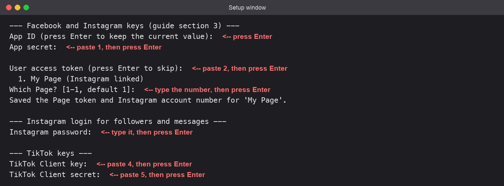
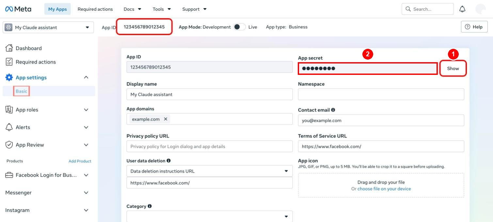
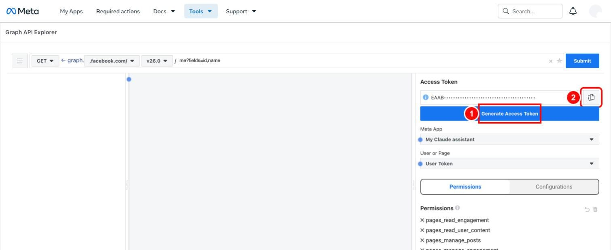
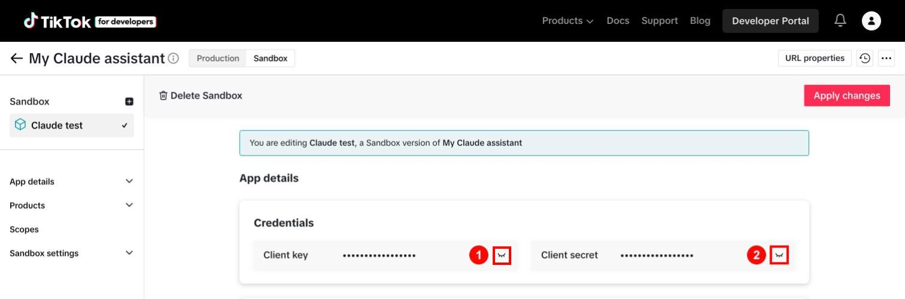

# Start Here: Let Claude set up the Instagram, Facebook and TikTok MCP

You do not need to follow the long guide. Install three small programs and a browser extension, log in to your accounts, download the project, paste one prompt into Claude, fill in a few blanks, and Claude does the setup with you. It works on Windows, Mac and Linux.

**Download source:** https://github.com/Urnesto/facebook-ig-mcp.git

## 1. What you need first

Accounts:

| You need | Notes |
|---|---|
| A Facebook account | The one that will own the Page |
| An Instagram Business or Creator account | Already created |
| A TikTok account (only if you want TikTok) | Set to private |
| A Claude account on a paid plan (Pro, Max, Team or Enterprise) | Needed for Claude Code and for the browser extension |
| Google Chrome (or Microsoft Edge) | Claude works in your browser through an extension |

Programs: three small programs and one browser extension must be installed once. You do not need a GitHub account, and nothing has to be bought. Follow the part for your computer.

### On Windows

1. Open **PowerShell**: click the **Start** button, type `PowerShell`, and press Enter. A blue or black window opens. You type or paste commands there and press Enter after each one. To paste, press **Ctrl+V** or right-click.
2. Install **Claude Code**. Paste this line and press Enter:

```
irm https://claude.ai/install.ps1 | iex
```

3. Install the **uv** helper:

```
powershell -ExecutionPolicy ByPass -c "irm https://astral.sh/uv/install.ps1 | iex"
```

4. Install **Git** (recommended). If this line gives an error, skip it; section 3 has a way without Git:

```
winget install --id Git.Git -e
```

5. Close the PowerShell window and open a new one, so the new programs are found.

### On a Mac

1. Open **Terminal**: press **Cmd+Space**, type `Terminal`, and press Enter. To paste, press **Cmd+V**.
2. Install **Claude Code**:

```
curl -fsSL https://claude.ai/install.sh | bash
```

3. Install the **uv** helper:

```
curl -LsSf https://astral.sh/uv/install.sh | sh
```

4. **Git** installs itself: the first time you use it, the Mac asks to install "command line developer tools". Click **Install** and wait.
5. Close the Terminal window and open a new one.

### The Claude browser extension (Windows and Mac)

Claude opens the Facebook, Instagram and TikTok pages for you and clicks through them. For that it needs the **Claude in Chrome** extension.

1. Open Google Chrome and go to https://claude.com/chrome
2. Click **Add to Chrome** and confirm.
3. Click the Claude icon in Chrome's toolbar and log in with your Claude account.

Without the extension Claude can still do the setup, but it can only give you links and instructions; you would do every click yourself.

Links if a command does not work:

- Claude Code setup: https://code.claude.com/docs/en/setup
- Claude Code with Chrome: https://code.claude.com/docs/en/chrome
- The `uv` helper: https://docs.astral.sh/uv/getting-started/installation/
- Git: https://git-scm.com/downloads

## 2. Log in to your accounts in Chrome first

Claude cannot type your passwords, so it cannot log in for you. Before you start Claude, open Chrome and log in to each of these. Stay logged in and leave Chrome open.

| Log in to | Link | Needed for |
|---|---|---|
| Facebook | https://www.facebook.com/login | Creating the Page and linking Instagram |
| Meta for Developers | https://developers.facebook.com/apps/ | The Meta app and the keys. Click **Continue with Facebook** |
| Instagram | https://www.instagram.com/accounts/login/ | Linking the Instagram account to the Page |
| TikTok | https://www.tiktok.com/login | Adding your account to the TikTok app (only for TikTok) |
| TikTok for Developers | https://developers.tiktok.com/login | The TikTok app and its keys (only for TikTok) |

If you have no developer accounts yet, sign up on the same pages. Both are free:

- Meta for Developers: https://developers.facebook.com/async/registration
- TikTok for Developers: https://developers.tiktok.com/signup

If Facebook asks for an SMS code or to confirm "this was you" while Claude works, do it on your phone. Claude waits.

## 3. Download the project and start Claude

From here on, every command is the same on Windows, Mac and Linux.

### With Git

Paste these lines one at a time and press Enter after each:

```
cd ~
git clone https://github.com/Urnesto/facebook-ig-mcp.git
cd facebook-ig-mcp
claude --chrome
```

### Without Git

1. Open this link in your browser. A ZIP file downloads: https://github.com/Urnesto/facebook-ig-mcp/archive/refs/heads/main.zip
2. Unpack it. On Windows, right-click the file and choose **Extract All**. On a Mac, double-click it.
3. Rename the unpacked folder from `facebook-ig-mcp-main` to `facebook-ig-mcp`.
4. Move the folder into your personal folder: `C:\Users\YourName` on Windows, or your home folder on a Mac.
5. In PowerShell or Terminal, paste these two lines:

```
cd ~/facebook-ig-mcp
claude --chrome
```

### The first time Claude starts

- Claude asks you to log in to your Claude account. Follow what it shows.
- If Claude asks whether to trust the files in this folder, choose **yes**.
- If Claude asks whether to use the **instagram** server from this project, choose **yes**.
- If Claude shows "Claude wants to use your browser", choose **Install extension** or **yes**. Type `/chrome` at any time to check that the browser is connected.

## 4. Copy this prompt, fill in the blanks, and paste it into Claude

Replace everything in square brackets with your own details. Delete the lines for parts you do not want.

```
Set up the Instagram, Facebook and TikTok MCP in this folder.
Use the setup-social-mcp skill and do every step you can yourself.
When you need me, tell me one thing to click or type and wait.

My details:
- Computer: [Mac / Windows / Linux]
- Parts I want: [Facebook and Instagram] [Followers and DMs] [TikTok]

Facebook and Instagram:
- Facebook Page name: [Ernest Claude]
- Create the Page if it does not exist: [yes / no]
- Page category: [Personal blog]
- Instagram username: [my_instagram_name]
- Meta app: [create a new one named "My Claude assistant" / use my app named ...]
- Read and answer my Instagram inbox (DMs people send me): [yes / no]

TikTok:
- TikTok username: [my_tiktok_name]
- TikTok app: [create a new one / use my app named ...]
- App description: [Posts my own videos to my TikTok account.]
- My website: [https://example.com]
- Terms of Service page: [https://example.com/terms]
- Privacy Policy page: [https://example.com/privacy]

Passwords and secret keys: open the setup wizard for me.
I will type them there myself. Do not ask for them in the chat.
```

## 5. What Claude does, and what you click and paste

Claude installs the project, creates the Facebook Page, opens every web page, fills in the forms with the details from your prompt, saves the settings that are not secret, runs the checks and connects everything.

Claude is not allowed to touch passwords and secret keys. It cannot reveal them, copy them or type them. So for five values it opens the right page and a **setup window** (a terminal window with a question in it), and you copy the value from the page and paste it into the setup window.

How to paste into the setup window: click the window, press **Cmd+V** on a Mac or **Ctrl+V** on Windows (or right-click), then press **Enter**. Nothing appears on screen while you paste a secret. That is normal.



*The setup window asks one question at a time. The red notes show which paste goes where.*

### The setup window, question by question

Claude opens the setup window for you. If you want to open it yourself, type this in a terminal in the project folder:

```
uv run python -m src.setup_wizard
```

It asks these questions, in this order. Answer each one and press **Enter**. To skip a question, or to keep a value that is already saved, just press **Enter**.

| The window asks | What you enter | Where you get it |
|---|---|---|
| `App ID` | Press Enter. Claude has already filled it in | Nothing to do |
| `App secret` | Paste the App secret | Paste 1 below |
| `User access token` | Paste the access token | Paste 2 below |
| `Which Page? [1-2, default 1]` | Type the number shown next to your Page | The list the window prints just above |
| `Instagram username, without @` | Press Enter if Claude filled it in, or type it | Your Instagram name |
| `Instagram password` | Type your Instagram password | You know it. Paste 3 below |
| `TikTok Client key` | Paste the Client key | Paste 4 below |
| `TikTok Client secret` | Paste the Client secret | Paste 5 below |

When it finishes, the window prints **Saved** and a list with `set` or `EMPTY` next to each value. `EMPTY` means that value is still missing; run the window again and fill in only that one.

Two more windows may follow. Claude opens them when they are needed:

| The window asks | What you enter | Where you get it |
|---|---|---|
| `Enter code (6 digits)` | The 6-digit code | The newest email from Instagram |
| Nothing: your browser opens a TikTok page | Click **Authorize** | In the browser |

If something goes wrong, the window prints a short message, for example "Could not get the Page token". Copy that message to Claude. Do not copy your keys.

### Paste 1. App secret

1. Claude opens your Meta app's settings page.
2. Click **Show** next to **App secret**. A window titled "Confirm with password" opens; click **Confirm**, type your Facebook password and submit.
3. Select the secret that appears and copy it.
4. In the setup window, at **App secret:**, paste and press Enter.



*1: click "Show" and confirm with your Facebook password. 2: the secret appears in this field; select it and copy it.*

### Paste 2. Access token

1. Claude opens the Graph API Explorer with your app and the permissions already selected.
2. Click the blue **Generate Access Token** button.
3. In the Facebook window that opens, select your **Page** and your **Instagram account**, and approve.
4. Click the copy icon to the right of the **Access Token** box.
5. In the setup window, at **User access token:**, paste and press Enter.
6. The setup window lists your Pages. Type the number next to your Page and press Enter.



*1: click "Generate Access Token" and approve in the Facebook window. 2: click the copy icon to copy the new token.*

**The permissions on the token.** Claude selects them for you before you click. They are listed above the **Add a Permission** dropdown, and the Facebook window asks you to approve them. You should see these:

| Permission | What it lets Claude do |
|---|---|
| `pages_show_list` | See your Pages |
| `pages_read_engagement` | Read your Facebook posts |
| `pages_read_user_content` | Read comments on your Page |
| `pages_manage_engagement` | Reply to, hide and delete Facebook comments |
| `pages_manage_posts` | Publish, edit and delete Facebook posts |
| `read_insights` | Read Facebook statistics |
| `instagram_basic` | Read your Instagram profile and posts |
| `instagram_content_publish` | Publish to Instagram |
| `instagram_manage_comments` | Read, reply to and hide Instagram comments |
| `instagram_manage_insights` | Read Instagram statistics |
| `business_management` | Reach a Page that belongs to a business account |
| `instagram_manage_messages` | Read and answer your Instagram inbox. Only if you said **yes** to the inbox in your prompt |
| `pages_manage_metadata` | Goes together with `instagram_manage_messages`. Only if you said **yes** to the inbox |

If one is missing, a tool that needs it is refused later. Tell Claude which one is missing before you click **Generate Access Token**. To add a permission afterwards, say: "Set up the Facebook and Instagram keys again."

### Paste 3. Instagram password

Only if you want the follower list and direct messages.

1. In the setup window, at **Instagram password:**, type your Instagram password and press Enter.
2. Claude opens a second setup window. Instagram emails you a 6-digit code. Type the code there and press Enter.

### Paste 4 and 5. TikTok Client key and Client secret

Only if you want TikTok.

1. Claude opens your TikTok app's **Sandbox** page.
2. Under **Credentials**, click the eye icon next to **Client key**, select the key and copy it.
3. In the setup window, at **TikTok Client key:**, paste and press Enter.
4. Do the same with **Client secret**, at **TikTok Client secret:**.
5. Claude opens a TikTok page in your browser. Click **Authorize**.



*1: click this eye icon to show the Client key, then copy it. 2: the same for the Client secret.*

### Other clicks Claude will ask for

| When | What you click | Why only you can |
|---|---|---|
| Starting Claude in the project folder | **Yes** to use the **instagram** server | It gives Claude the tools |
| Creating the Facebook Page | Finish the SMS check in the Facebook app on your phone, if Facebook asks | Security check on your account |
| Linking Instagram to the Page | **Connect account**, then log in to Instagram | Your login |
| Adding your TikTok account to the app | **Add account**, **Continue**, then log in to TikTok | Your login |
| Any time Claude says "log in" | Log in on the page it opened | Your password |


*Linking Instagram: click "Connect account" and log in to Instagram.*

## 6. When Claude says it is done

Try these, one at a time:

- "Show my Instagram profile info."
- "Show my last 5 Facebook posts."
- "Get my Instagram followers."
- "Which TikTok account is connected?"
- "Show my Instagram usage."

To publish something, just ask, for example: "Post this on my Facebook Page: Hello!" Claude shows you the text and asks before anything goes out.

## 7. If you get stuck

- Say to Claude: "Check what is missing in my setup." It lists which settings are filled in, without showing them.
- The full guide with a screenshot for every click is `SETUP_GUIDE.md` in the project folder, also as `Instagram_MCP_Setup_Guide.docx`.
- Every command and tool, with what it does, is listed in `docs/CLAUDE_CODE_GUIDE.md`.
- The project on GitHub: https://github.com/Urnesto/facebook-ig-mcp

## 8. Using it in Claude every day

### Start Claude

Open a terminal (Terminal on a Mac, PowerShell on Windows) and paste these two lines:

```
cd ~/facebook-ig-mcp
claude --chrome
```

Then type `/mcp`. The line **instagram** should say connected. If it does not, select it and choose reconnect.

### Just ask in plain words

You never type tool names. Say what you want and Claude picks the right tool.

| You want to | Say something like |
|---|---|
| See your Instagram profile | "Show my Instagram profile." |
| See your latest posts | "Show my last 5 Instagram posts." / "Show my last 5 Facebook posts." |
| See how a post did | "How did my latest Instagram post perform?" |
| See Page statistics | "Show my Facebook Page statistics for this week." |
| Post on Facebook | "Post this on my Facebook Page: (your text)" |
| Post on Facebook later | "Schedule this Facebook post for tomorrow at 10:00: (your text)" |
| Post a photo on Instagram | "Publish this photo on Instagram: (link to the photo), caption: (your text)" |
| Post a video on TikTok | "Post clip.mp4 from my Downloads folder to TikTok with the caption: (your text)" |
| Read comments | "Show the comments on my latest Facebook post." |
| Answer a comment | "Reply to that comment: Thank you!" |
| Hide a comment | "Hide that comment." |
| Get your followers | "Get my Instagram followers." / "Who is new since last time?" |
| Message someone | "Send a DM to USERNAME: (your text)" |
| See what is used up | "Show my Instagram usage." |

### Claude asks before it acts

Before anything is published, sent or deleted, Claude shows you exactly what it is about to do and asks for permission. Read it, then choose **yes** or **no**. Reading things (profile, posts, comments, statistics) needs no confirmation of the content, only your approval to use the tool the first time.

### Things to know

- **Instagram photos need a web link.** Instagram only accepts a picture or video that is already on a public web address, not a file on your computer. TikTok videos can come straight from a file.
- **TikTok posts are private at first.** They stay visible only to you until TikTok has reviewed and audited your app.
- **There are daily limits.** 25 Instagram posts, 25 Facebook posts, 15 TikTok posts, 20 direct messages and 10 follower downloads per 24 hours. Claude tells you when a limit is reached.
- **No double messages.** Claude refuses to message a person it has already messaged, unless you clearly say you want to message them again.
- **Reading your Instagram inbox needs three things.** The two inbox permissions on the token (`instagram_manage_messages` and `pages_manage_metadata`), the switch **Allow access to messages** turned on in the Instagram app (Settings → Messages and story replies → Message controls → Connected tools), and a message from someone who has a role on your Meta app. Messages from everyone else appear only after Meta grants the app "Advanced Access"; `INSTAGRAM_DM_SETUP.md` explains how to ask for it. Sending a DM to a username does not need any of this.
- **Followers and direct messages to any user are unofficial.** Instagram does not approve of them. Use them sparingly and never send the same text to many people.

### When something stops working

| What you see | What to do |
|---|---|
| Claude does not know the Instagram tools | Type `/mcp` and reconnect **instagram** |
| "Token is invalid" or a permission error | Say: "Set up the Facebook and Instagram keys again." |
| "Instagram sent a verification code" | Say: "Log me in to Instagram again." and type the emailed code in the window that opens |
| "Not logged in to TikTok" | Say: "Log me in to TikTok again." and click **Authorize** in the browser |
| "Limit reached" | Wait, or ask "Show my Instagram usage." |
| Claude says you have no Instagram conversations, but you do | Check the three things under "Reading your Instagram inbox" above. Then say: "Set up the Facebook and Instagram keys again, with the inbox permissions." |
| Anything else | Say: "Check what is missing in my setup." |
